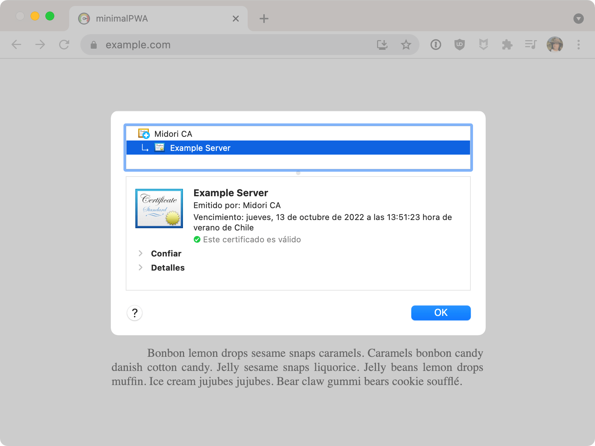
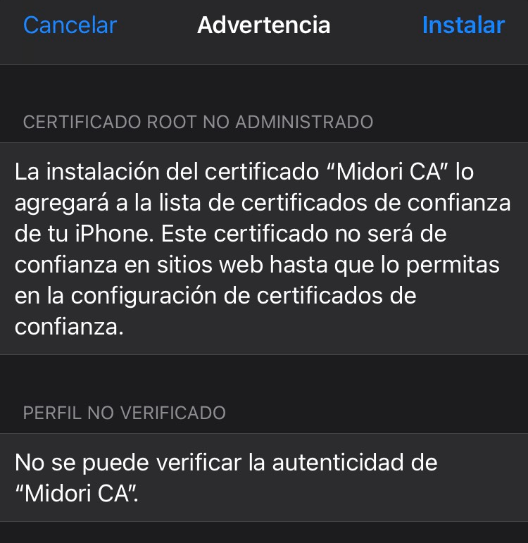
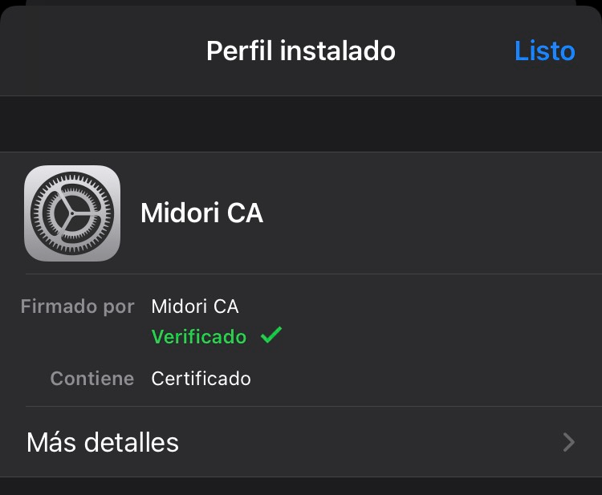
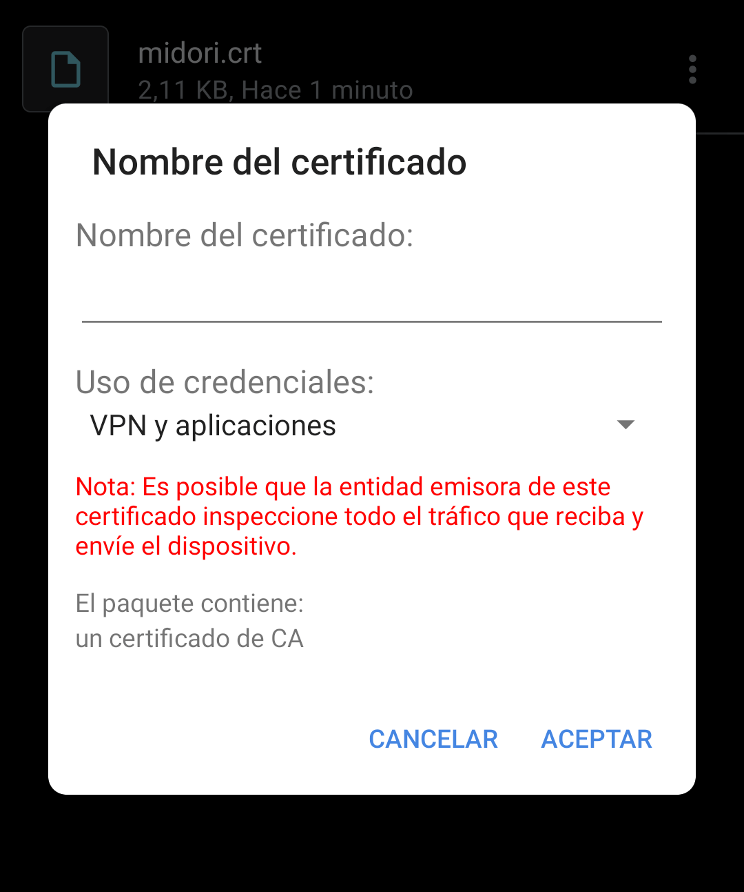
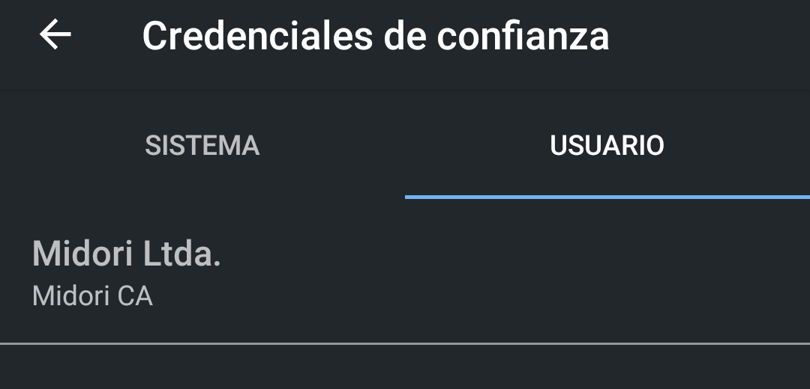
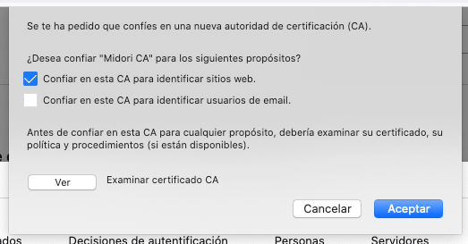
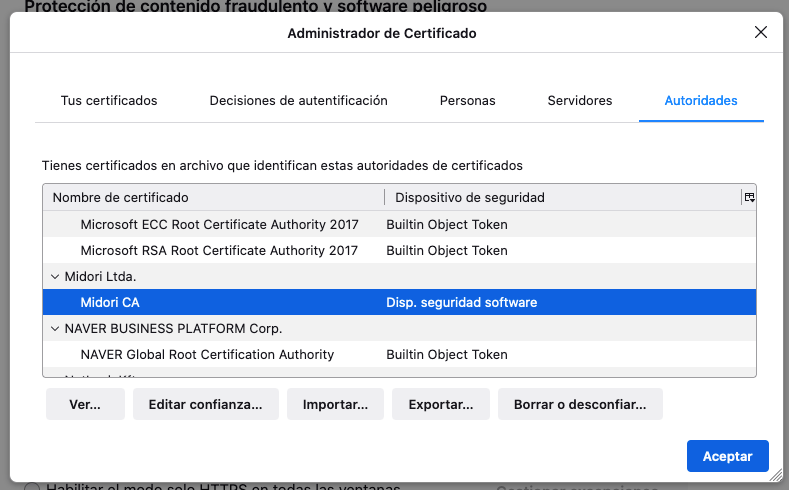

# Create development SSL certificates

Create self-signed SSL certificates to **use in development only**. 

- [x] create and install CA certificate
- [x] create one or more SSL certificates for HTTP services
- [x] Use in development enviroment
- [x] Share CA certificates in clients
- [ ] ~~Use in production~~



**Always review any shell executable code**. Also evaluate the parameters used to create any SSL certificate. However, this software does not generate certificates in a way that allows them to be used in public production.

Whenever possible try to use the [Let’s Encrypt](https://letsencrypt.org) service that you can easily implement through [Certbot](https://certbot.eff.org).

## Step 0: Clone repo

`~/createDevSSL` directory used in the following executions.

```cmd
$ git clone https://github.com/nhereveri/createDevSSL.git ~/createDevSSL
$ cd ~/createDevSSL
```

## Step 1: Edit default values

**Check openssl config** and edit default values in file `config.template`:

```ini
countryName_default             = CL
stateOrProvinceName_default     = Biobio
localityName_default            = Concepcion
0.organizationName_default      = Midori Ltda.
emailAddress_default            = nelson@hereveri.cl
```

## Step 2: Create certification authority (CA)

```cmd
$ bash createCA.sh
```

Some interactive commands are executed.

## Step 3: Adding trusted certificate to a client

### MacOS
```cmd
$ security add-trusted-cert -d -r trustRoot -k /Library/Keychains/System.keychain certs/ca.cert.pem
```

### CentOS like

```cmd
$ yum install ca-certificates
$ update-ca-trust force-enable
$ cp certs/ca.cert.pem /etc/pki/ca-trust/source/anchors/
$ update-ca-trust extract
```

### Debian like

```cmd
$ cp certs/ca.cert.pem /usr/local/share/ca-certificates/
$ update-ca-certificates
```

### Windows like

```cmd
C:\> certutil -addstore -f "ROOT" certs\ca.cert.pem
```

### Mobile testing

Later you can publish, via HTTP, the CA certificate created (`certs\ca.cert.pem`) and download it to your test devices. Depending on the OS you will be asked to trust this certificate.

#### iOS





#### Android





### Browser testing

Some web browsers use their own list of CA certificate authorities ignoring those indicated in the OS. In them it is necessary to load these certificates (`certs\ca.cert.pem`) manually. Generally this option is available in the Security section.

#### Firefox





## Step 4: Create service SSL certificate

Use script `createServer.sh` to create each certificate. Use list of one or more domains as parameters.

`localhost` domain and `127.0.0.1` IP are both included in all certificate by default.

```cmd
$ bash createServer.sh example.com admin.example.com www.example.com
```

## Step 5: Adding SSL certificate to your server

```cmd
$ cd /path/to/ssl/
$ tar zxvf ~/createDevSSL/example.com.tgz
```

## Step 6: Edit HTTP service config

### Apache

```apache
Listen 443 https
Protocols h2 http/1.1

ServerName example.com
ServerAlias admin.example.com
ServerAlias www.example.com

SSLEngine on
SSLCertificateFile      /path/to/ssl/example.com.crt
SSLCertificateKeyFile   /path/to/ssl/example.com.key
```

### Nginx

```nginx
server {
    listen 443 ssl http2;
    listen [::]:443 ssl http2;

    server_name example.com admin.example.com www.example.com;

    ssl_certificate /path/to/ssl/example.com.crt;
    ssl_certificate_key /path/to/ssl/example.com.key;
}
```

## Final step

Repeat steps 4, 5 and 6 for more services that use the same certificate authority CA.

## SSL config

Stay tuned for the security recommendations for the use of certificates and encryption. As a recommendation visit [SSL Configuration Generator](https://ssl-config.mozilla.org) to obtain appropriate configuration parameters.
